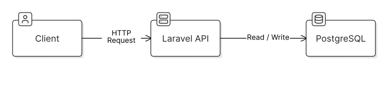
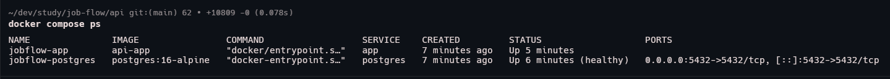

# JobFlow

> An experimental asynchronous job processing platform built to explore backend engineering concepts through hands-on experiments.

JobFlow is a learning-driven project focused on understanding the engineering problems behind reliable background job processing.

Instead of relying on existing queue abstractions from the beginning, the project starts with a simple implementation and evolves as new problems are discovered, reproduced, and solved.

## Why JobFlow?

The goal of this project is to deepen my backend engineering knowledge by exploring real-world problems involving asynchronous processing and distributed systems.

Some of the topics I plan to explore include:

- Queues and workers
- Concurrency and race conditions
- Retries, backoff, and jitter
- Idempotency and delivery guarantees
- Priority queues and scheduling
- Worker failures and crash recovery
- Observability and metrics
- Horizontal scaling
- Distributed systems
- Kubernetes

## Learning Approach

The project follows a simple principle:

> **Don't hide the problem. Reproduce it. Understand it. Fix it. Prove the fix.**

Whenever possible, engineering problems will be intentionally reproduced before their solutions are implemented.

The evolution of the project will be documented through experiments, learning notes, architecture decisions, diagrams, benchmarks, and visual evidence.

## Initial Architecture

  

JobFlow intentionally starts with a minimal architecture. New infrastructure and abstractions will only be introduced when there is a concrete problem that justifies them.

## Initial Environment

  

## Tech Stack

Currently:

- Laravel
- PHP
- PostgreSQL
- Docker

The stack will evolve throughout the project as new concepts are explored.

## Documentation

More detailed documentation can be found in [`docs/`](docs/):

- [`PROJECT_VISION.md`](docs/PROJECT_VISION.md) — project motivation and scope
- [`LEARNING_GOALS.md`](docs/LEARNING_GOALS.md) — concepts I want to study
- [`ROADMAP.md`](docs/ROADMAP.md) — project evolution and milestones

Additional learning logs, experiments, architecture decisions, and benchmarks will be added as the project evolves.

## Status

🚧 **Work in progress — early development**

The project is currently in its initial setup and experimentation phase.